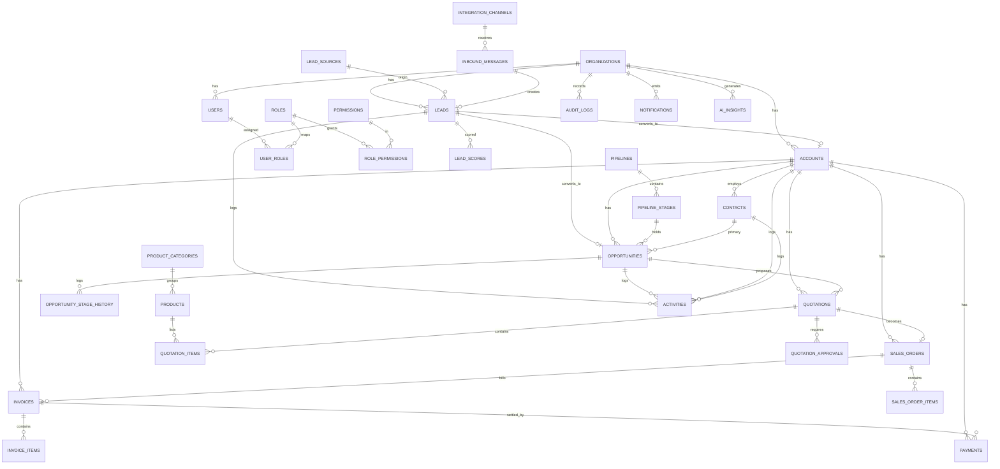
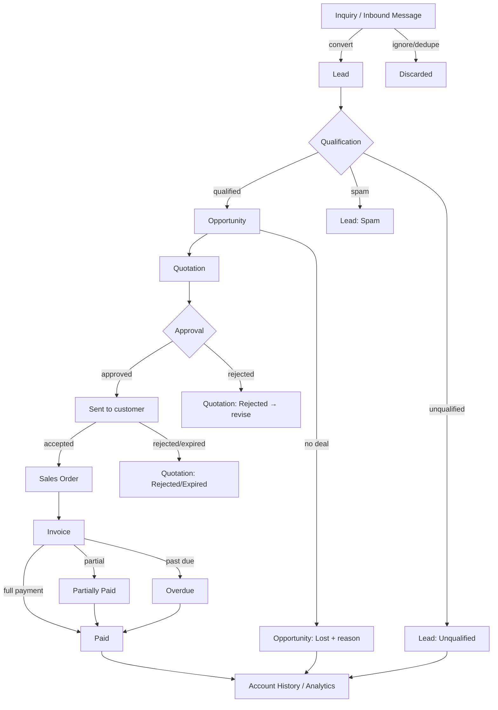

# Phase 0 — Product & Architecture Specification
### CRM + Sales Management Platform for SMEs

> **Status:** Draft for approval · **Owner:** Architecture · **Date:** 2026-08-31
> **Rule:** No implementation begins until Sections 1–7 and the stack decision (Section 0) are approved.

---

## 0. Recommended Technology Stack (DECISION REQUIRED)

The source brief fixes *architecture principles* (modular, API-first, multi-tenant-ready, money-safe, auditable, AI-ready) but not a stack. This is the one blocking decision before Phase 1. Recommendation below; the rest of this document is deliberately stack-agnostic so it survives a different choice.

| Layer | Recommendation | Why |
|---|---|---|
| Language | **TypeScript** end-to-end | One language, shared types (DTOs, enums, state machines) between API and UI. |
| Backend | **NestJS** | Its module system maps 1:1 to the domain modules in §3. Guards → RBAC, interceptors → audit, pipes → validation, providers → adapters. |
| DB | **PostgreSQL** | Relational integrity for the Lead→Payment chain; `NUMERIC` for money; row-level `organization_id` for multi-tenancy; JSONB only for genuinely open fields (tags, metadata, AI payloads). |
| ORM | **Prisma** (or TypeORM) | Typed schema, migrations, mass-assignment safety via explicit `select`. |
| Cache / Queue | **Redis + BullMQ** | Background jobs: notifications, AI scoring, integration ingestion, forecast rollups. |
| Frontend | **Next.js (App Router) + React** | Desktop-first SaaS shell, server components for heavy tables, route map = §9. |
| UI kit | **Tailwind + shadcn/ui**, TanStack Table/Query, Zod | Dense, professional, accessible; not "AI-dashboard flashy." |
| Auth | Session or JWT + refresh, RBAC guards | See §11. |
| AI | Provider-agnostic **adapter** (Claude default) | AI stays advisory (§12). |
| Integrations | **Adapter pattern** + webhook ingress, n8n-friendly | Channels never touch domain logic (§13). |
| Repo | **Monorepo** (`apps/api`, `apps/web`, `packages/shared`) | Shared enums/state machines/permission matrix as a single source of truth. |

**Alternative if the team is PHP-first:** Laravel + Filament + Livewire + PostgreSQL. Same domain model applies; only §10/§12 wiring changes. Confirm the stack before Phase 1.

---

## 1. Product Overview

**What it is.** A central *sales operating system* for SMEs (5–250 employees, B2B-first) that unifies fragmented inquiry channels (Facebook, Messenger, website, email, WhatsApp, phone, walk-in, referral, spreadsheets) into one governed pipeline and drives the full commercial lifecycle:

```
ACQUIRE → QUALIFY → SELL → APPROVE → FULFILL → BILL → COLLECT → ANALYZE → AUTOMATE
Inquiry → Lead → Qualification → Opportunity → Quotation → Approval → Sales Order → Invoice → Payment → Account History
```

**Who it's for.** Service businesses, software/IT providers, trading companies, distributors, construction, agencies, professional services — organizations that today lose leads across channels and cannot see their pipeline, ownership, or cash conversion.

**Value proposition.**
- *For sales reps:* nothing falls through the cracks — one inbox, owned leads, driven follow-ups.
- *For managers:* real-time pipeline value, weighted forecast, win/loss, rep performance, approval control.
- *For finance:* quotation→order→invoice→payment with no re-keying, and collections visibility.
- *For the business:* a auditable, extensible platform that later grows into a multi-company SaaS with an embedded AI Sales Copilot.

**Core principle.** This is **not** a CRUD address book. Every module must earn its place in the lifecycle above. Deterministic business logic is authoritative; AI only recommends.

---

## 2. User Roles

Seven roles ship in MVP. Permissions are enforced by RBAC (capability × entity) **and** data scoping (own / team / org). Full matrix in §11.

| Role | Responsibility | Data scope | Signature powers |
|---|---|---|---|
| **Super Admin** | Platform/tenant owner. Config, integrations, billing. | All orgs (or full org) | Everything, incl. destructive + settings. |
| **Administrator** | Org admin. Users, roles, pipelines, sources, approval rules. | Whole org | Manage config & users; not cross-org. |
| **Sales Manager** | Runs a team. Assigns leads, coaches, first-line approver. | **Team** | Approve (per thresholds), reassign, view team pipeline/reports. |
| **Sales Representative** | Works leads→deals→quotes. | **Own** (leads, opportunities, assigned accounts) | Create/edit own records, submit quotes for approval. |
| **Finance** | Invoices, payments, collections. | Org (commerce entities) | Issue invoices, record payments, void (audited). |
| **Approver** | Department Head / Executive in the approval chain. | Org (approval queue) | Approve/reject quotations at their tier. |
| **Viewer / Management** | Read-only exec visibility. | Org (read) | Dashboards, reports, export (if granted). No mutations. |

Notes: a user may hold multiple roles; the effective permission is the **union**. "Management" is Viewer + full reporting/export. Rep scope is configurable (own-only vs. team-visible).

---

## 3. Module Architecture

Modular domains — no god-controllers, no god-services. Each module owns its entities, service, and API surface, and depends on others only through defined interfaces/events.

```
                         ┌───────────────────────── Platform ─────────────────────────┐
                         │  Auth · Users · Roles/Permissions · Organizations · Settings │
                         └──────────────────────────────┬───────────────────────────────┘
                                                         │
   ── Acquire ──────────────┬─── Qualify/Sell ───────────┼──── Commerce ────────────┬── Insight/Automation ──
   Integrations (adapters)   Leads      Accounts          Opportunities  Quotations   Reports/Analytics
   Inbox (inbound_messages)  Lead       Contacts          Pipeline       Approvals    Dashboard
                             Sources    Activities        (stages+       Sales Orders  Forecast
                             Scoring                        history)      Invoices     Notifications
   Catalog (Products)                                                     Payments     AI (Insights/Copilot)
                                                                                        Audit (cross-cutting)
```

**Cross-cutting services** (used by all): `Audit`, `Notifications`, `Files/Attachments`, `Notes`, `Search`, `Import/Export`, `AI`.

**Communication rules.**
- Synchronous domain calls go through a module's **service interface** only.
- Lifecycle transitions emit **domain events** (`lead.converted`, `opportunity.stage_changed`, `quotation.approved`, `invoice.overdue`, `payment.recorded`). Audit, Notifications, AI, Forecast subscribe. This keeps the chain decoupled and future-automation (n8n) trivial.
- Integrations and AI never call domain write logic directly except through the same public services (so validation, RBAC, audit always run).

---

## 4. Complete Entity Model

Conventions applied to **every business-owned table** (omitted below for brevity):
`id` (uuid pk), `organization_id` (fk, **tenant scope**, indexed on every table), `created_at`, `updated_at`, `created_by`, `updated_by`, soft-delete `deleted_at`.
Money is stored as **integer minor units** (`bigint`, e.g. centavos) **plus** `currency` (char3); never float. Line/tax math is computed server-side and persisted.

### Platform

**organizations** — `name, legal_name, slug (uniq), domain, timezone, base_currency, status(active|suspended), plan, settings jsonb`.
**users** — `email(uniq per org), password_hash, first_name, last_name, phone, avatar, status(active|invited|disabled), last_login_at, is_super_admin`. Idx: `(organization_id,email)`.
**roles** — `key, name, description, is_system`. **permissions** — `key (e.g. leads.create), description`. **role_permissions** — `role_id, permission_id`. **user_roles** — `user_id, role_id` (+ optional `team_id` scope). **teams** — `name, manager_id`. **team_members** — `team_id, user_id`.

### Acquire

**lead_sources** — `key, label, category(social|web|email|messaging|offline|partner|other), is_active, config jsonb`. Seeded (Facebook, Messenger, Website, Email, WhatsApp, Referral, Event, Walk-in, Cold Outreach, Partner, Manual Entry, Other); admins add more.
**leads** — `lead_no(uniq), name, company, contact_person, email, phone, mobile, source_id, industry, interest (product/service text or product_id), estimated_budget(minor), currency, location, assigned_user_id, status(enum §7), score(int), priority(low|med|high|urgent), tags text[], notes, last_contacted_at, next_followup_at, converted_account_id, converted_contact_id, converted_opportunity_id, lost_reason, lost_notes`. Idx: `(organization_id,status)`, `(organization_id,assigned_user_id)`, `(organization_id,source_id)`, `next_followup_at`, trigram on `name/company/email`.
**lead_scores** — snapshot of scoring: `lead_id, model(BANT|MEDDIC|custom), criteria jsonb(need,budget,authority,timeline,fit…), total, classification(HOT|WARM|NURTURE|LOW), scored_by(user|ai), scored_at`. History-retaining (one row per (re)score).

### Accounts & Contacts

**accounts** — `name, industry, address, city, country, website, phone, tax_id, tax_info jsonb, owner_id, status(prospect|active|inactive|churned), customer_since, tags text[], notes`. Idx: `(organization_id,owner_id)`, trigram `name`.
**contacts** — `account_id(fk, nullable for orphan contact), first_name, last_name, job_title, department, email, phone, mobile, is_decision_maker bool, is_primary bool, comm_preference(email|phone|whatsapp|…), notes`. Idx: `(organization_id,account_id)`, trigram `first/last/email`. A contact keeps its FK links to historical opportunities/quotations even if account changes.

### Opportunities & Pipeline

**pipelines** — `name, is_default, is_active`. **pipeline_stages** — `pipeline_id, name, sort_order, default_probability(int 0–100), type(open|won|lost), sla_days(nullable)`. Default pipeline seeded: Discovery→Qualification→Solution/Demo→Proposal→Negotiation→Decision→Closed Won/Lost.
**opportunities** — `name, account_id, primary_contact_id, owner_id, pipeline_id, stage_id, amount(minor), currency, probability(int), expected_close_date, source_id, priority, competitor, next_action, next_action_at, status(open|won|lost), lost_reason, lost_notes, closed_at, stage_entered_at`. Derived: `weighted_amount = amount*probability/100`. Idx: `(organization_id,stage_id)`, `(organization_id,owner_id)`, `expected_close_date`, `status`.
**opportunity_stage_history** — `opportunity_id, from_stage_id, to_stage_id, from_prob, to_prob, changed_by, changed_at, duration_in_prev_stage_seconds`. Written on every stage change (audit + "days in stage" + cycle metrics).

### Activities

**activities** — `type(call|email|meeting|demo|followup|task|note|site_visit|other), subject, description, owner_id, related_type(lead|account|contact|opportunity|quotation), related_id, due_date, due_time, priority, status(open|done|cancelled), reminder_at, outcome, completed_at`. Polymorphic link via `(related_type, related_id)`. Idx: `(organization_id,owner_id,status)`, `(related_type,related_id)`, `due_date`.

### Catalog

**product_categories** — `name, parent_id`. **products** — `sku(uniq), name, category_id, description, type(product|service|subscription|custom), unit, default_price(minor), currency, cost(minor), tax_rate_id, is_active`. **tax_rates** — `name, rate_bp(basis points), is_inclusive, is_active`.

### Commerce (money-critical — server-side math only)

**quotations** — `quote_no(uniq), account_id, opportunity_id, contact_id, owner_id, issue_date, expiry_date, status(enum §7), currency, subtotal(minor), discount_total(minor), tax_total(minor), grand_total(minor), terms, payment_terms, delivery_terms, validity_days, notes, approval_state(none|pending|approved|rejected), version`. Idx: `(organization_id,status)`, `opportunity_id`.
**quotation_items** — `quotation_id, product_id(nullable for custom), description, quantity(numeric), unit, unit_price(minor), discount_type(pct|amount), discount_value, tax_rate_id, line_subtotal(minor), line_tax(minor), line_total(minor), sort_order`.
**quotation_approvals** — `quotation_id, tier(int), required_role, approver_id, decision(pending|approved|rejected), decided_at, comments, submitted_by, submitted_at`. One row per required tier; deal approved only when all required tiers approve (§11).
**sales_orders** — `order_no(uniq), account_id, quotation_id, owner_id, order_date, status(enum §7), currency, subtotal/discount/tax/grand_total(minor), delivery_status(pending|partial|delivered), billing_status(unbilled|partial|billed), terms, notes`.
**sales_order_items** — mirror of quotation_items (`sales_order_id, product_id, description, quantity, unit, unit_price, discount, tax, line_total`), copied on conversion (no re-keying).
**invoices** — `invoice_no(uniq), account_id, sales_order_id(nullable — direct invoice allowed), issue_date, due_date, status(enum §7), currency, subtotal/tax/total(minor), amount_paid(minor, derived from payments), outstanding(minor, derived), payment_status(unpaid|partial|paid)`. Idx: `(organization_id,status)`, `due_date`, `payment_status`.
**invoice_items** — `invoice_id, product_id, description, quantity, unit_price, discount, tax, line_total`.
**payments** — `payment_ref(uniq), invoice_id, account_id, payment_date, amount(minor), currency, method(cash|bank_transfer|gcash|maya|check|credit_card|other), reference_number, bank, received_by, notes`. On insert → recompute invoice `amount_paid/outstanding/payment_status` in a transaction. Idx: `(organization_id,invoice_id)`, `payment_date`.

### Cross-cutting

**notes** — `related_type, related_id, body, author_id, pinned`. **attachments** — `related_type, related_id, filename, mime, size, storage_key, uploaded_by`.
**notifications** — `user_id, type, title, body, related_type, related_id, channel(inapp|email|sms|…), read_at, sent_at`. **notification_preferences** — `user_id, type, channel, enabled`.
**audit_logs** — `actor_id, action, entity_type, entity_id, old_values jsonb, new_values jsonb, ip, user_agent, created_at`. Append-only; idx `(entity_type,entity_id)`, `actor_id`, `created_at`.
**integration_channels** — `provider(facebook|messenger|email|website|whatsapp|api|import|n8n), name, status, credentials_ref(secret vault key — never plaintext), config jsonb`. **inbound_messages** — `channel_id, external_id(uniq per channel — dedupe), from_name, from_handle, subject, body, received_at, raw jsonb, status(new|linked|converted|ignored), linked_lead_id`.
**ai_insights** — `subject_type(lead|opportunity|quotation|pipeline|org), subject_id, kind(lead_score|followup|opp_score|forecast|briefing|draft), payload jsonb, model, confidence, status(suggested|accepted|dismissed), created_by(ai), created_at`. AI output lands here as a **suggestion**; acting on it is an explicit user write elsewhere.

---

## 5. ERD (Mermaid)



---

## 6. Workflow — full lifecycle & alternative paths



Every transition emits a domain event → audit + notifications + AI/forecast recompute.

---

## 7. CRM State Machines

Only listed transitions are legal; the service layer rejects others and every transition is audited.

**Lead** — `new → contacted → attempting_contact → qualified → converted`; any → `unqualified | lost | spam`. Terminal: `converted, unqualified, lost, spam`. `qualified → converted` is the only path that spawns Account/Contact/Opportunity.

**Opportunity** — `open` moves across pipeline stages (Discovery→…→Decision). From any open stage: `→ won` (requires amount + close date) or `→ lost` (**requires** loss_reason). Terminal: `won, lost`. Stage change writes `opportunity_stage_history`.

**Quotation** — `draft → for_approval → approved → sent → viewed → accepted`; `for_approval → rejected(→ back to draft as new version)`; `sent/viewed → rejected | expired`; any non-terminal → `cancelled`. Terminal: `accepted, rejected, expired, cancelled`. Only `accepted` may create a Sales Order. Editing an `approved`/`sent` quote forks a new `version` (approval resets).

**Sales Order** — `draft → confirmed → in_fulfillment → fulfilled`; any → `cancelled`. Independent `billing_status: unbilled → partial → billed`. Only a confirmed+ order may generate invoices.

**Invoice** — `draft → issued → sent`; `sent → partially_paid → paid`; `sent/partially_paid → overdue` (time-based) → `paid`; `draft/issued → void | cancelled`. Terminal: `paid, void, cancelled`. `payment_status` and `overdue` are computed, never hand-set.

**Payment** — `recorded` (immutable) with optional `reversed` (audited compensating entry; no hard delete). Recording a payment recomputes the parent invoice atomically.

---

## 8. Dashboard Specification

Each widget = KPI + calculation + source + drill-through. All figures respect the viewer's data scope (own/team/org).

| Widget | Calculation | Source | Action |
|---|---|---|---|
| Total / New / Qualified Leads | counts by `status` (New; Qualified) | leads | → filtered lead list |
| Open / Won / Lost Opportunities | counts by `status` | opportunities | → pipeline |
| Pipeline Value | Σ `amount` where open | opportunities | → pipeline |
| Weighted Pipeline | Σ `amount*probability/100` where open | opportunities | → forecast |
| Expected Revenue | weighted, filtered to close-date in period | opportunities | → forecast |
| Revenue Won (MTD) | Σ `amount` where won && closed_at in month | opportunities | → won list |
| Quotations Pending / Awaiting Approval | counts by status/approval_state | quotations | → approval queue |
| Sales Orders | count open | sales_orders | → orders |
| Outstanding Invoices | Σ `outstanding` where not paid | invoices | → AR aging |
| Payments Received (period) | Σ `amount` | payments | → payments |
| Sales Funnel | count per stage | opp_stage / leads | → stage |
| Lead Source Breakdown | count/conversion by source | leads | → source report |
| Conversion Rates | lead→opp, opp→won, quote→order | multiple | → reports |
| Rep Performance | pipeline, won, win-rate per owner | opportunities | → rep report |
| Recent Activities | last N | activities | → entity |
| Overdue Follow-ups | activities `due_date < today && open` | activities | **highlighted** → activity |
| Upcoming Activities | next 7 days | activities | → calendar |
| Aging Opportunities | `now - stage_entered_at > sla_days` | opportunities | → opp |

Dashboards are **actionable** (every tile drills through); no decorative-only widgets.

---

## 9. Screen Inventory

```
/dashboard

/leads                /leads/:id            /leads/inbox
/accounts             /accounts/:id
/contacts             /contacts/:id
/opportunities        /opportunities/pipeline   /opportunities/:id
/activities

/quotations           /quotations/:id       /quotations/:id/pdf
/sales-orders         /sales-orders/:id
/invoices             /invoices/:id         /invoices/:id/pdf
/payments             /payments/:id

/products             /products/:id
/reports              /reports/:key
/analytics/pipeline   /analytics/forecast

/settings/users       /settings/roles
/settings/pipelines   /settings/lead-sources
/settings/approval-rules   /settings/integrations   /settings/organization

/auth/login  /auth/forgot  /auth/reset  /auth/invite/:token
```

Sidebar groups: Dashboard · Sales (Leads, Inbox, Accounts, Contacts, Opportunities, Activities) · Commerce (Quotations, Sales Orders, Invoices, Payments) · Catalog (Products, Services) · Analytics (Pipeline, Forecast, Reports) · Automation (Workflows, Integrations) · Administration (Users, Roles, Pipelines, Lead Sources, Approval Rules, Settings).

---

## 10. API Architecture (REST, versioned `/api/v1`)

All routes are tenant-scoped by the authenticated org, RBAC-guarded, validated (Zod/DTO), rate-limited, and audited on mutation. List endpoints support `?page&limit&sort&q&filter[...]`.

```
Auth        POST /auth/login | /logout | /refresh | /forgot | /reset ; GET /me
Users/Roles GET/POST /users ; PATCH /users/:id ; GET /roles ; PUT /roles/:id/permissions
Leads       GET/POST /leads ; GET/PATCH /leads/:id ; POST /leads/:id/score
            POST /leads/:id/convert  (→ account+contact+opportunity, tx)
            POST /leads/:id/assign ; POST /leads/import ; GET /leads/export
Inbox       GET /inbox ; POST /inbox/:id/convert ; POST /inbox/:id/ignore
Accounts    GET/POST /accounts ; GET/PATCH /accounts/:id ; GET /accounts/:id/timeline
Contacts    GET/POST /contacts ; GET/PATCH /contacts/:id
Opps        GET/POST /opportunities ; GET/PATCH /opportunities/:id
            POST /opportunities/:id/stage  (writes history)
            POST /opportunities/:id/win | /lose (reason required)
Pipeline    GET /pipelines ; GET /pipeline/board
Activities  GET/POST /activities ; PATCH /activities/:id ; POST /:id/complete
Products    GET/POST /products ; PATCH /products/:id
Quotations  GET/POST /quotations ; GET/PATCH /quotations/:id
            POST /:id/submit ; POST /:id/approve ; POST /:id/reject
            POST /:id/send ; POST /:id/accept ; POST /:id/convert-to-order
            GET  /:id/pdf
Orders      GET/POST /sales-orders ; GET/PATCH /:id ; POST /:id/confirm ; POST /:id/invoice
Invoices    GET/POST /invoices ; GET/PATCH /:id ; POST /:id/send ; POST /:id/void ; GET /:id/pdf
Payments    GET/POST /payments ; GET /:id
Reports     GET /reports/:key?filters ; GET /analytics/forecast ; GET /dashboard/summary
Notifs      GET /notifications ; POST /:id/read
AI          POST /ai/score-lead ; POST /ai/opportunity-risk ; POST /ai/draft-quote
            GET  /ai/briefing ; GET /ai/insights?subject=
Integrations POST /webhooks/:provider (public ingress, signature-verified)
Audit       GET /audit?entity=&id=
Search      GET /search?q=
```

Money-affecting endpoints (quotation/order/invoice totals) **ignore client-sent totals** and recompute server-side.

---

## 11. Permission Matrix (role × capability)

`✔ all` · `◑ own/team scope` · `—` none. Capabilities: V view, C create, E edit, D delete, A approve, X export, S assign/reassign.

| Capability | Super Admin | Admin | Sales Mgr | Sales Rep | Finance | Approver | Viewer/Mgmt |
|---|---|---|---|---|---|---|---|
| Leads | ✔ | ✔ | ◑team V/E/S | ◑own V/C/E | — | — | V |
| Accounts/Contacts | ✔ | ✔ | ◑team | ◑own | V | — | V |
| Opportunities | ✔ | ✔ | ◑team +S | ◑own C/E | V | — | V |
| Activities | ✔ | ✔ | ◑team | ◑own | ◑own | — | V |
| Products | ✔ | ✔ | V | V | V | V | V |
| Quotations | ✔ | ✔ | ◑team C/E | ◑own C/E/submit | V | V | V |
| Quotation **Approve** | ✔ | ✔ | **A (tier1)** | — | — | **A (tier2/3)** | — |
| Sales Orders | ✔ | ✔ | V/C | ◑own C | C/E | — | V |
| Invoices | ✔ | ✔ | V | V | **C/E/void** | — | V |
| Payments | ✔ | ✔ | V | V | **C** | — | V |
| Reports/Forecast | ✔ | ✔ | ◑team | ◑own | ✔ (AR) | — | ✔ |
| Export (X) | ✔ | ✔ | ◑ | ◑ (if granted) | ✔ | — | ◑ |
| Import | ✔ | ✔ | ◑ | — | — | — | — |
| Settings/Users/Roles/Integrations | ✔ | ✔ | — | — | — | — | — |
| Delete (D, soft) | ✔ | ✔ | — | — | — | — | — |
| Audit log view | ✔ | ✔ | ◑team | — | ◑ | — | — |

**Approval thresholds (configurable, seeded default):** `< ₱100k` → Sales Manager; `₱100k–₱500k` → Sales Manager + Department Head; `> ₱500k` → Sales Manager + Department Head + Executive. Stored in `approval_rules`; each threshold generates the required `quotation_approvals` tiers on submit.

---

## 12. AI Architecture — advisory boundary

**Deterministic core is authoritative.** AI reads context and writes only to `ai_insights` as `suggested`. Any state change requires an explicit human/user API action that runs normal validation, RBAC, and audit.

| AI capability | Input | Output (suggestion) | Boundary |
|---|---|---|---|
| Lead qualification | inquiry text, lead fields | score, classification, recommended action, draft reply | Does **not** set official score without user accept. |
| Follow-up suggestions | opportunities w/ no recent activity | at-risk list, draft message | Creates no activity/message until user sends. |
| Quotation drafting | opportunity, catalog | descriptions, scope, notes, terms, summaries | **Never sets or changes price/approval.** |
| Opportunity scoring | qualification, engagement, stage age, win history | win probability, risk, next action | Advisory; official `probability` stays user/stage-driven unless explicitly configured. |
| Pipeline forecasting | pipeline, weighted values | projected/high-confidence/at-risk narrative | Read-only summary. |
| Executive briefing | day's leads/follow-ups/approvals/AR | prioritized morning brief | Read-only. |

**AI may NOT** auto: approve quotations, change approved pricing, issue refunds, delete records, record payments, or close high-value deals. Provider-agnostic adapter (`AiProvider` interface; Claude default) so the model can be swapped. All prompts/outputs stored with model + confidence for auditability.

---

## 13. Integration Architecture — adapter pattern

Channels never touch domain logic. Each provider implements an `InboundAdapter` that normalizes raw payloads into `inbound_messages`; a single **Inbox → Lead** path governs conversion (with dedupe on `external_id` and fuzzy match on email/phone).

```
Facebook ─┐
Messenger ├─ InboundAdapter → normalize → inbound_messages ─┐
Website  ─┤  (signature verify, dedupe)                     ├─ Inbox UI → convert → Leads (domain)
Email    ─┤                                                 │
WhatsApp ─┘                                                 │
                                                    OutboundAdapter ← Notifications (email/SMS/WA/Telegram/push)
n8n / API ── webhooks (in & out) ── domain events ──────────┘
Accounting / Payment Gateway ── future OutboundAdapter (invoice sync, payment capture)
```

Principles: secrets in a vault (`credentials_ref`, never plaintext/client-side); every channel is a row in `integration_channels` (toggle without code); domain emits events that adapters subscribe to (so n8n/external systems consume without coupling). MVP may simulate inbound via Manual Entry + a generic webhook; the adapter contract is fixed now so real providers slot in later.

---

## 14. MVP vs. Future Scope

**MVP (ship first)**
Auth + org + users/roles (RBAC) · Accounts/Contacts · Leads + sources + manual scoring · Inbox (manual + generic webhook) · Activities/follow-ups · Opportunities + configurable-ish pipeline + Kanban + stage history · Product catalog · Quotations + items + approval workflow · Sales Orders · Invoices · Payments · Dashboard · Core reports · In-app notifications · CSV import/export · Audit log · Global search.

**Phase 2**
Configurable pipelines/approval rules UI · Loss analysis reporting · Forecast by dimension · Email/SMS notification channels · Real channel adapters (FB/Messenger/Email/WhatsApp/website form) · PDF quote/invoice theming · Advanced permission editor · n8n workflow triggers.

**Phase 3 / AI**
AI lead qualification · follow-up suggestions · quotation drafting · opportunity scoring · pipeline forecasting · executive briefing · workflow automation engine · payment-gateway & accounting integrations · multi-company/tenant SaaS admin.

---

## 15. Development Roadmap

Sequential features; each is a shippable slice. Foundational rules (tenant scope, money-as-integer, audit, RBAC guard, event bus) are built in **Sprint 01** and reused everywhere — never retrofitted.

| # | Feature | Objective | DB | Backend | Frontend | Tests | Acceptance | Depends |
|---|---|---|---|---|---|---|---|---|
| 01 | Foundation/Auth/Org | Tenant + auth + audit + event bus + money util | orgs, users, audit_logs | auth, guards, tenant middleware, audit interceptor | login, app shell/sidebar | auth, tenant isolation, audit write | User signs in; every request org-scoped; mutations audited | — |
| 02 | Users + Roles | RBAC | roles, permissions, user_roles, teams | permission guard, seed matrix §11 | users/roles admin | permission matrix enforced | Rep blocked from admin routes | 01 |
| 03 | Accounts + Contacts | Customer core | accounts, contacts | CRUD services | list/detail/timeline | scope + validation | Rep sees own; Mgr sees team | 02 |
| 04 | Lead Management | Capture + convert | leads, lead_sources, lead_scores | CRUD, convert tx, manual score | leads list/detail, score panel | convert creates account+contact+opp; dedupe | Convert produces linked records, audited | 03 |
| 05 | Activities | Follow-ups | activities | polymorphic CRUD, overdue query | activity feed, calendar, overdue badge | overdue/upcoming logic | Overdue highlighted on dashboard | 04 |
| 06 | Opportunities | Deals | opportunities, stage_history | stage/win/lose services | opp list/detail | stage machine + reason-required-on-loss | Illegal transition rejected; history written | 04 |
| 07 | Sales Pipeline | Kanban | (reuse) pipelines, stages | board query | drag-drop board | stage change = history + event | Card moves persist + audit | 06 |
| 08 | Product Catalog | Reusable items | products, categories, tax_rates | CRUD | catalog admin | tax/price validation | Items reusable in quotes | 02 |
| 09 | Quotations | Proposals | quotations, quotation_items | line + total calc (server) | builder UI, PDF | totals recomputed server-side; float-free | Grand total correct; client totals ignored | 06,08 |
| 10 | Approval Workflow | Governance | quotation_approvals, approval_rules | threshold engine, submit/approve/reject | approval queue | tiers generated by amount; history | ₱600k needs 3 tiers | 09 |
| 11 | Sales Orders | Fulfillment | sales_orders(+items) | convert-from-quote (copy items) | order list/detail | no re-keying; only accepted quote | Order mirrors quote exactly | 09 |
| 12 | Invoices | Billing | invoices(+items) | generate-from-order, overdue job | invoice list/detail, PDF | status machine; overdue computed | Invoice from order; overdue auto-flag | 11 |
| 13 | Payments | Collections | payments | record → recompute invoice tx | payment form, AR aging | partial/paid math; no hard delete | Partial payment → partially_paid | 12 |
| 14 | Dashboard | Visibility | (reads) | summary aggregations | tiles + funnel + drill-through | scope-correct KPIs | Every tile drills through, scope-correct | 04–13 |
| 15 | Reports | Analytics | (reads) | report queries + filters | report views/export | conversion/win/AR correctness | Filters by date/rep/source/stage | 14 |
| 16 | Notifications | Nudges | notifications, prefs | event subscribers, in-app | bell + list | fires on domain events | Overdue follow-up notifies owner | 05,10,12,13 |
| 17 | Import/Export | Data ops | — | CSV parse/validate, error report | import wizard | validation + error CSV | Bad rows reported, good rows imported | 03,04,08 |
| 18 | Integrations | Channels | integration_channels, inbound_messages | adapter contract, webhook ingress, Inbox | inbox UI | dedupe + convert | Webhook → inbox → lead | 04 |
| 19 | AI Copilot | Assist | ai_insights | AiProvider adapter, endpoints §12 | suggestion panels | outputs are suggestions only | AI never mutates domain directly | 04–15 |
| 20 | Automation | Workflows | — | event → n8n outbound, rule triggers | workflow admin | events emitted reliably | External flow triggered by event | 16,18 |

**Per-phase gate:** inspect existing code → reuse conventions → state plan → implement → test → lint → build → check regressions. Never overwrite working functionality without understanding it first.

---

### Decisions — CONFIRMED (2026-08-31)
1. ✅ **Stack:** NestJS (API) + Next.js (web) + PostgreSQL + Prisma + Redis/BullMQ, TypeScript monorepo (`apps/api`, `apps/web`, `packages/shared`).
2. ✅ **Currency:** single base currency **₱ (PHP)** for MVP. Every money column still stores integer minor units + `currency` char3 so multi-currency is an additive later change, not a rewrite.
3. ✅ **Tenancy:** single-org deploy, **tenant-ready schema** — `organization_id` on every business table from day one; multi-tenant SaaS admin deferred to Phase 3.
4. ⏳ **PDF generation** — *default:* server-side HTML→PDF (Puppeteer) with a templated layout; revisit at Sprint 09 (Quotations). Not blocking.

On approval of Sections 1–7, I'll proceed to **Sprint 01 (Foundation/Auth/Org)** and nothing earlier.
